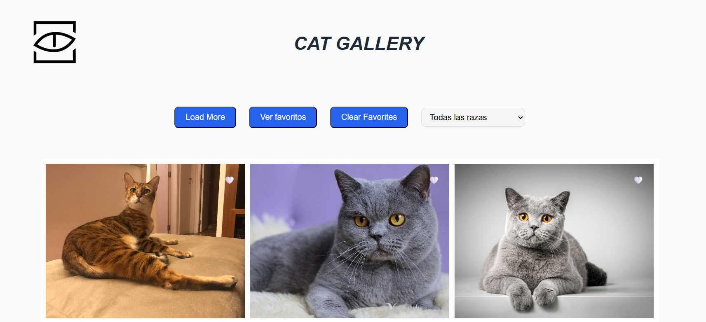

# CatGallery

Galería de imágenes de gatos con filtrado por raza, favoritos persistentes y diseño responsive.

---

## Descripción breve
CatGallery es una pequeña SPA que consume TheCatAPI para mostrar imágenes de gatos. Permite:
- Navegar una galería paginada.
- Filtrar por raza.
- Marcar/desmarcar favoritos que se persisten en localStorage.
- Ver la vista de favoritos con posibilidad de eliminar.
- Mostrar un modal informativo con datos de la raza al pasar el ratón.

La UI está construida con HTML, SCSS (estructura modular) y JavaScript moderno (ES Modules / Vite).

---

## Características
- Mobile-first: grid responsive (1 columna en móvil, 2 en tablet, 3 en desktop).
- Persistencia de favoritos usando localStorage (clase FavoritesStorage).
- Peticiones a TheCatAPI a través de un cliente sencillo (`CatApi` + `fetchClient`).
- Componentes UI: Gallery, Favorite, Modal, Notificacion, Filter.
- SCSS modular con variables y breakpoints en `sass/abstracts/_variables.scss`.

---

## Estructura principal del proyecto
- src/
  - app/ (entrada principal)
    - app.js
  - services/
    - catApi.js
  - storage/
    - favoriteStorage.js
  - ui/
    - gallery.js
    - favorites.js
    - modal.js
    - notifications.js
    - filter.js
  - main.js
- sass/
  - abstracts/
    - _variables.scss      (breakpoints y tokens)
    - _mixins.scss
  - components/
    - _hero.scss
  - layout/
    - _sidebar.scss
  - main.scss
- index.html
- dist/ (build)

Archivo compilado de ejemplo: `dist/assets/index-B_1_fv-v.css` y `dist/assets/index-CM-hspqQ.js`.

---

## Requisitos
- Node.js >= 16
- npm o yarn
- Clave de TheCatAPI (registro en https://thecatapi.com)

---

## Variables de entorno
Crea un archivo `.env` en la raíz con la variable (Vite requiere prefijo VITE_):

VITE_CAT_API_KEY=tu_api_key_aqui

No commitees claves reales al repositorio.

---

## Instalación & desarrollo (Linux)
1. Instalar dependencias:
   - npm
     - npm install
   - yarn
     - yarn

2. Ejecutar en modo desarrollo:
   - npm run dev
   - or yarn dev

3. Generar build de producción:
   - npm run build
   - or yarn build

4. Vista previa del build:
   - npm run preview
   - or yarn preview

(estos scripts asumen un setup típico de Vite; adaptar si tu package.json usa otros nombres)

---

## Notas de diseño responsive
- Breakpoints definidos en `sass/abstracts/_variables.scss`:
  - $bp-tablet: 768px
  - $bp-desktop: 1200px
  - $bp-desktop-xl: 1440px
- Las grids principales usan la estrategia mobile-first:
  - grid-template-columns: 1fr (por defecto)
  - @media (min-width: $bp-tablet) => repeat(2, 1fr)
  - @media (min-width: $bp-desktop) => repeat(3, 1fr)
- Para controlar el ancho máximo en pantallas muy grandes se usa `max-width: 1200px` en `.hero` y `.hero__favorites`.

---

## Puntos de interés en el código
- `src/services/catApi.js` — cliente para TheCatAPI; añade header `x-api-key`.
- `src/storage/favoriteStorage.js` — wrapper simple de localStorage (getAll, add, remove, removeAll, isFavorite).
- `src/ui/gallery.js` — renderizado de tarjetas, paginado y conexión con favoritos y modal.
- `src/ui/favorites.js` — render de la lista de favoritos y eliminación.
- `src/ui/modal.js` — modal posicionado sobre la tarjeta (hover).
- `sass/components/_hero.scss` y `sass/layout/_sidebar.scss` — reglas para .hero y .hero__favorites.

---

## Buenas prácticas / recomendaciones
- Mantener la API key fuera del repositorio y usar .env local.
- Evitar exponer claves en `dist/` (el build actual puede contener una clave visible).
- Considerar `repeat(auto-fill, minmax(...))` si se desea un comportamiento de columnas más fluido en anchos grandes.
- Añadir tests unitarios si se planea ampliar lógica (p. ej. FavoritesStorage).

---

## Troubleshooting
- Si no se ven imágenes:
  - Revisar la variable VITE_CAT_API_KEY.
  - Verificar límites/rate limit de TheCatAPI.
- Si aparecen errores CORS: comprobar las políticas de la API y requests desde el origen.

---

## Contribución
1. Fork & clone
2. Crear rama feature/mi-cambio
3. Abrir PR con descripción clara

---

## Licencia
Añadir licencia al proyecto (por ejemplo MIT) según necesidad.

